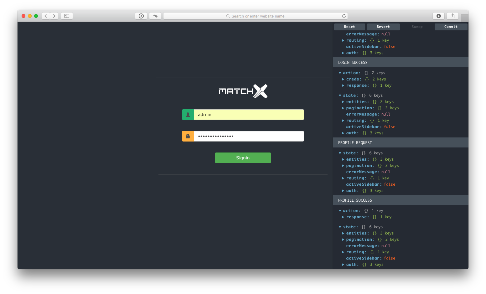

# Lora Redux UI

This project is an enhancement of the original UI part of the [LoRa App Server](https://github.com/brocaar/lora-app-server) - an open source LoRaWAN application-server.
The main objective of this project is to have better management of the data flow and have better management of the UI Component in React. Serval React UI Components (such as Maps, Nodes) are extended for Data Visualization.

## Settings

Project is booted with [Redux Real World](https://github.com/reactjs/redux/tree/master/examples/real-world), which is actually built on top of [Create React App](https://github.com/facebookincubator/create-react-app).
So Create-React-App provides the basic configuration to program a React Fronted-End project, and as for Redux,
the principle of `single state object tree` provides us a very simple way to manage all the object entities in our projects. With bundled DevTools and Loggers, we can see all the actions and state trees, which make us have a clear understanding of what is going on with our codes.

[React-Bootstrap](https://react-bootstrap.github.io) is used here to provide basic UI Component, [Styled-components](https://github.com/styled-components/styled-components) here can be either used to make and style our own Component or extend react-bootstrap Components or other non-UI Components like (react-router Components). The exciting thing about this is that you can write actual CSS code inside of your Component! Cool!

```javascript
/*
  Inside of your Component
  In this example, we combine the power of styled-components and react-bootstrap
  Simplfy our Code A LOT!
*/
import styled from 'styled-components'
import {
  FormGroup, FormControl, InputGroup,
} from 'react-bootstrap'

const ColorAddon = styled(InputGroup.Addon)`
  border: 0px !important;
  background-color: ${props => props.color ? props.color: 'default' } !important;
`

const PartOfForm = () => {
  <FormGroup controlId="formHorizontalUsername">
    <InputGroup>
      <ColorAddon color={"#28b779"}><Glyphicon glyph="user" /></ColorAddon>
      <FormControl type="text" placeholder="Username" ref="username"/>
    </InputGroup>
  </FormGroup>
}
```

## Demos

Demo Login Page with DevTools.



## Available Scripts

In the project directory, you can run:

#### `npm start`

Runs the app in the development mode.<br>
Open [http://localhost:3000](http://localhost:3000) to view it in the browser.

```
/*
  this line can be added to package.json if you want to api call,
  and make sure backend Lora App server is running on `port 8899`
*/
"proxy": "http://localhost:8899"
```

You will also see any lint errors in the console.

#### `npm run build`

Builds the app for production to the `build` folder.<br>
It correctly bundles React in production mode and optimizes the build for the best performance.

The build is minified and the filenames include the hashes.<br>
Your app is ready to be deployed!
